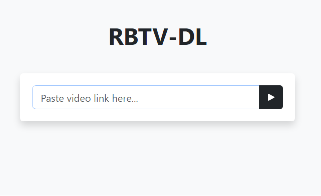

# Red Bull TV Downloader
Red Bull TV Downloader available as both a CLI tool and a Web UI. Built with React/Next.js and Python-Flask



# Quick Start: Web UI (Docker):
Run the container:
```
docker run -d -p 8080:8080 bboymega/rbtv-dl:1.0
```
and open http://127.0.0.1:8080 in your browser. You should be able to access the WebUI locally.

# CLI Usage: 
```
python3 rbtv-dl-cli.py url [-o OUTPUT]

positional arguments:
  url                   URL of Video Page

optional arguments:
  -o OUTPUT, --output OUTPUT
                        Set Output Path
```

Requirements (for CLI):

```
ffmpeg

```

Installing prerequisite packages:
```
apt install ffmpeg (For Debian & Ubuntu)
python3 -m venv venv
source venv/bin/activate
pip3 install -r requirements.txt
```
