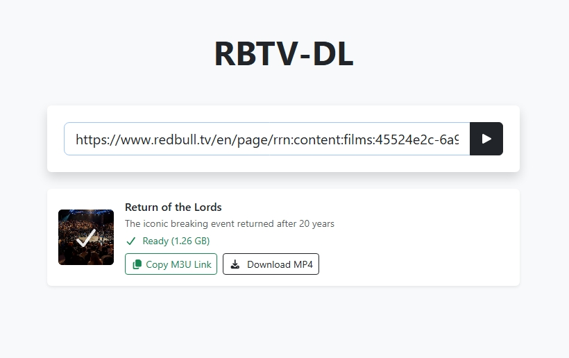

# Red Bull TV Downloader
Red Bull TV Downloader available as both a CLI tool and a Web UI. Built with React/Next.js and Python-Flask



# Quick Start: Web UI (Docker):
Run the container:
```
docker run --rm -d -p 8080:8080 bboymega/rbtv-dl:4.0
```
and open `http://127.0.0.1:8080` (or `http://[server-ip]:8080`) in your browser. You should be able to access the WebUI locally.

# CLI Usage: 
```
python3 rbtv-dl-cli.py url [-o OUTPUT]

positional arguments:
  url                   URL of Video Page

optional arguments:
  -o OUTPUT, --output OUTPUT
                        Set Output Path
```

Requirements (for CLI):

```
ffmpeg
```

Installing prerequisite packages:
```
apt install ffmpeg (For Debian & Ubuntu)
python3 -m venv venv
source venv/bin/activate
pip3 install -r requirements.txt
```

# Changlog
```
## 2026-03-17
- Added regional auto-detection.

## 2026-03-11
- Updated compatibility for Red Bull TV API v5.1

## 2026-03-10
- Fixed a bug where yt-dlp was required but not installed when building the image.

## 2026-03-09
- Fixed issues with the search filter.
- Fixed a bug where the trailer was downloaded instead of the main video when a trailer was available.
```